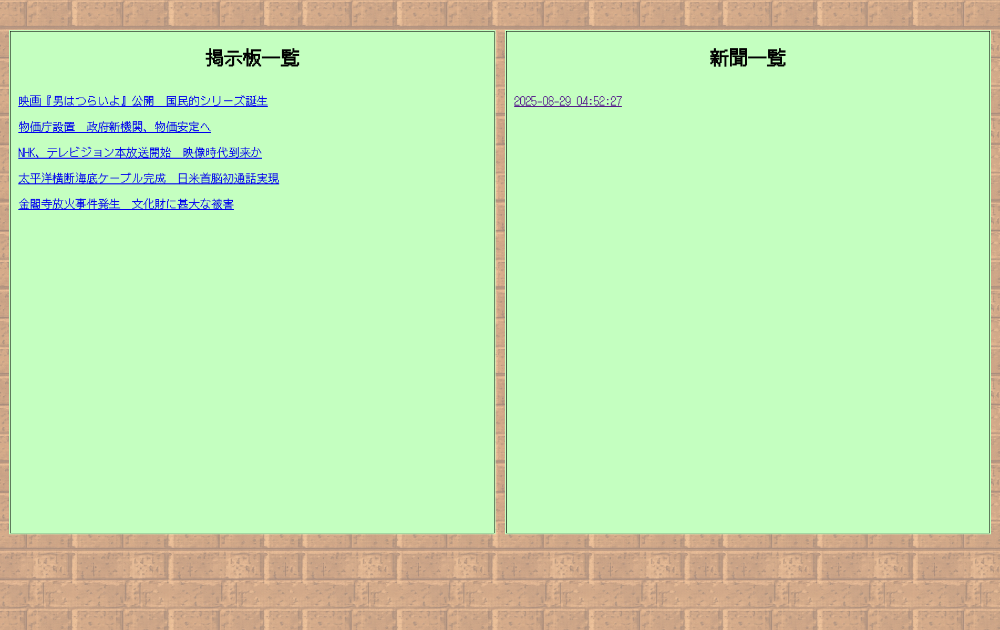
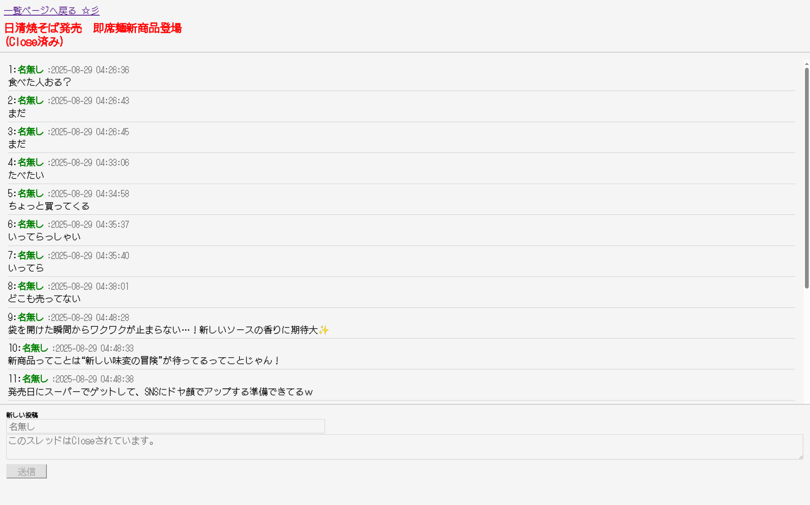

# ちょべりぐ新聞掲示板

## 概要
本アプリは**昔あったニュースをおもしろおかしく改変するエンタメを提供するアプリケーション**です。\
本アプリは、投稿型掲示板サイトです。本アプリは、事前に過去のニュースからテーマが決められた5つのスレッドがあり、ユーザにはスレッド内でそのニュースがあった当時の人間になり切って投稿をしていただきます。\
嘘を吐いてもOK！知らないニュースについて想像で語ってもOK！ユーザはこのスレッド内で、与えられたテーマについて自由に投稿を行うことが出来ます。
スレッドでの会話が多くなると、スレッドがcloseされ、スレッド内の会話を元に新聞が生成されます。\
あなた達だけのオリジナルのレトロ新聞を、面白おかしく、そして自由に作りましょう！

## 機能概要

### スレッド・新聞一覧
画面左に公開状態のスレッド、画面右に生成済み新聞一覧が表示される\
公開されているスレッドが全てcloseされると、新たなスレッドタイトルが5つ生成される
スレッドタイトルをクリックすると、スレッド詳細画面へ遷移する
新聞一覧をクリックすると新聞詳細へ遷移する


### スレッド詳細
スレッド詳細では、スレッド内での投稿一覧を表示する\
投稿は画面下のテキストボックスに入力して、「送信」ボタンを押すことで送信する
そのスレッド内で投稿が会った場合、リアルタイムで画面を更新する


スレッド内の投稿件数が20件に達すると、そのスレッドはcloseされ、追加の投稿ができなくなる


## 新聞詳細
5つのスレッドが全てcloseされると、新聞が生成され、新聞一覧の一番上に追加される


新聞の本文をクリックすると、その記事をモーダルで表示する


各記事の見出しをクリックすると、記事の生成元のcloseしたスレッドを閲覧することができる

## 実行方法
### Deno Deploy
https://akaishitaku-2025-summer-66.deno.dev

### local環境

### gemini APIを用いた処理の実行準備
`.env.copy`から`.env`を作成
```shell
cp .env.copy .env
```
[Google AI Studio](https://aistudio.google.com/apikey?hl=ja)からgeminiのAPI KEYを取得し、`.env`内の`GOOGLE_API_KEY`に入れる

### 実行手順
1. このリポジトリをclone
```shell
git clone https://github.com/jigintern/2025-summer-b.git
```

2. denoで`server.deno.ts`を起動
```shell
deno task start
```

3. local serverへアクセス
```
http://localhost:8000
```
